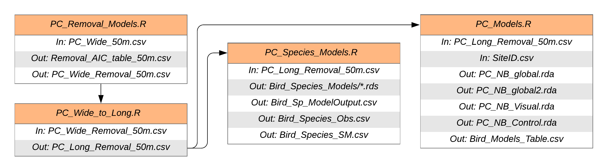

```{r setup}

```

## Point count data

We start with raw data (truncated at 50 m) in wide format `Data/PC_Wide_50m.csv`, and run removal models `Scripts/PC_Removal_Models.R` following https://peter.solymos.org/code/2018/08/30/fitting-removal-models-with-the-detect-r-package.html to get a similar dataset with detection probabilities `Data/PC_Wide_Removal_50m.csv`

We then take this data from wide to long format with the R script `Scripts/PC_Wide_to_Long.R`. This is because GitHub has a file size limit of 100 Mb, and the long formatted data `Data/PC_Long_Removal_50m.csv` is beyond this limit (**Note this file is in the `.gitignore` file for this reason - committing and then attempting to push a file of this size can be quite an issue**).

For an 'all birds' combined model, we run generalized linear mixed effects models in `Scripts/PC_Models.R` and store model objects as `Model_Objects/*.rda` files. Instead of running models (it takes some minutes), one can load these objects directly (`PC_NB_global.rda`, `PC_NB_global2.rda`, `PC_NB_Visual.rda`, `PC_NB_Control.rda`).

For individual species of birds, we run generalized linear mixed effects models in `Scripts/PC_Species_Models.R` and store model objects as `Model_Objects/Bird_Species_Models/*.rds` files. Instead of running models (it takes some minutes), one can load these objects directly. Full list of model objects below:

```{r Species models}
dir("Model_Objects/Bird_Species_Models")
```

